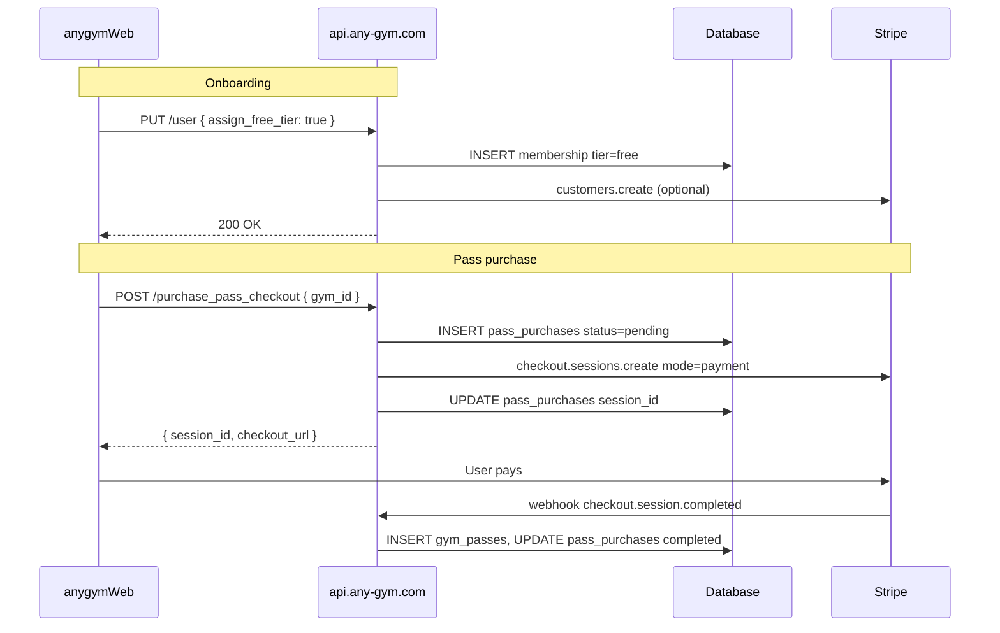

# API Implementation Guide — Free Tier & Pay-Per-Pass

This document is the **detailed implementation spec** for `api.any-gym.com` to support the free tier and individual pass purchases. The anygymWeb frontend is already built against these contracts.

For database migrations and Stripe Dashboard setup, see [FREE_TIER_SETUP.md](./FREE_TIER_SETUP.md).

---

## Table of contents

1. [Architecture](#1-architecture)
2. [Authentication](#2-authentication)
3. [Database prerequisites](#3-database-prerequisites)
4. [Endpoint changes summary](#4-endpoint-changes-summary)
5. [PUT /user — assign free tier](#5-put-user--assign-free-tier)
6. [GET /user — membership response](#6-get-user--membership-response)
7. [GET /gyms and GET /gyms/{id}](#7-get-gyms-and-get-gymsid)
8. [POST /generate_pass — block free tier](#8-post-generate_pass--block-free-tier)
9. [POST /purchase_pass_checkout — new](#9-post-purchase_pass_checkout--new)
10. [Stripe webhook handler](#10-stripe-webhook-handler)
11. [Shared pass creation logic](#11-shared-pass-creation-logic)
12. [GET /user/passes — pass cost](#12-get-userpasses--pass-cost)
13. [Subscription upgrade (free → paid)](#13-subscription-upgrade-free--paid)
14. [Error codes reference](#14-error-codes-reference)
15. [Manual testing (curl)](#15-manual-testing-curl)
16. [Implementation checklist](#16-implementation-checklist)

---

## 1. Architecture



**Key principle:** Passes for free tier users are **never** created until Stripe confirms payment via webhook.

---

## 2. Authentication

All user-scoped endpoints use the existing pattern:

| Mechanism | Value |
|-----------|-------|
| Header | `auth0_id: <Auth0 sub claim>` |
| Body (some endpoints) | `auth0_id` duplicated in JSON |

The web app always sends the header. Validate that the header matches any `auth0_id` in the request body when both are present.

**Unauthorized:** Return `401` if header is missing or user not found.

---

## 3. Database prerequisites

Run these before deploying API code (adjust names to your schema):

```sql
-- Gym pricing
ALTER TABLE gyms ADD COLUMN IF NOT EXISTS price_per_pass DECIMAL(10, 2) NULL;

-- Payment records
CREATE TABLE IF NOT EXISTS pass_purchases (
  id SERIAL PRIMARY KEY,
  auth0_id TEXT NOT NULL,
  gym_id INTEGER NOT NULL REFERENCES gyms(id),
  pass_id INTEGER NULL REFERENCES gym_passes(id),
  amount DECIMAL(10, 2) NOT NULL,
  currency VARCHAR(3) NOT NULL DEFAULT 'gbp',
  stripe_checkout_session_id TEXT UNIQUE,
  stripe_payment_intent_id TEXT,
  status VARCHAR(20) NOT NULL DEFAULT 'pending',
  created_at TIMESTAMPTZ NOT NULL DEFAULT NOW(),
  updated_at TIMESTAMPTZ NOT NULL DEFAULT NOW()
);

CREATE INDEX IF NOT EXISTS idx_pass_purchases_auth0_id ON pass_purchases(auth0_id);
CREATE INDEX IF NOT EXISTS idx_pass_purchases_session ON pass_purchases(stripe_checkout_session_id);

-- Link pass to purchase
ALTER TABLE gym_passes
  ADD COLUMN IF NOT EXISTS purchase_id INTEGER NULL REFERENCES pass_purchases(id);
```

Ensure `gym_passes.pass_cost` exists (the web app already maps `pass_cost` from API responses).

---

## 4. Endpoint changes summary

| Endpoint | Method | Change |
|----------|--------|--------|
| `/user` | PUT | Handle `assign_free_tier: true` |
| `/user` | GET | Return `membership.tier: "free"` when applicable |
| `/gyms` | GET | Include `price_per_pass` on each gym |
| `/gyms/{id}` | GET | Include `price_per_pass` |
| `/generate_pass` | POST | Reject `tier === 'free'` |
| `/purchase_pass_checkout` | POST | **New** — create Stripe Checkout |
| `/user/passes` | GET | Include `pass_cost` on purchased passes |
| `/stripe/webhook` | POST | Handle pass purchase completion |

---

## 5. PUT /user — assign free tier

### Called by

anygymWeb onboarding when user clicks **"Continue with Free"**.

### Request

**Headers:**
```
Content-Type: application/json
auth0_id: auth0|abc123
```

**Body:**
```json
{
  "full_name": "Jane Doe",
  "name": "Jane Doe",
  "date_of_birth": "1990-01-15",
  "address_line1": "1 High Street",
  "address_line2": null,
  "address_city": "London",
  "address_postcode": "SW1A 1AA",
  "emergency_contact_name": "John Doe",
  "emergency_contact_number": "+447700900000",
  "onboarding_completed": true,
  "assign_free_tier": true
}
```

### Implementation steps

```
1. Validate auth0_id header present
2. Update user profile fields (existing logic)
3. Set onboarding_completed = true
4. IF assign_free_tier === true:
   a. IF user already has active PAID membership (stripe_subscription_id IS NOT NULL):
        → Do NOT downgrade. Ignore assign_free_tier or return 409.
   b. ELSE upsert membership:
        tier = 'free'
        status = 'active'
        monthly_limit = 0
        visits_used = 0
        guest_passes_limit = 0
        guest_passes_used = 0
        price = 0
        stripe_subscription_id = NULL
   c. IF user has no stripe_customer_id:
        → stripe.customers.create({ email, metadata: { auth0_id } })
        → save stripe_customer_id on user record
5. Return updated user object
```

### Response

`200 OK` — same shape as existing `GET /user` user object, with nested `membership`:

```json
{
  "auth0_id": "auth0|abc123",
  "full_name": "Jane Doe",
  "onboarding_completed": true,
  "stripe_customer_id": "cus_xxx",
  "membership": {
    "id": 42,
    "user_id": "auth0|abc123",
    "tier": "free",
    "status": "active",
    "monthly_limit": 0,
    "visits_used": 0,
    "guest_passes_limit": 0,
    "guest_passes_used": 0,
    "price": 0,
    "stripe_subscription_id": null,
    "stripe_customer_id": "cus_xxx",
    "current_period_start": "2026-07-01T00:00:00Z",
    "current_period_end": null,
    "next_billing_date": null,
    "created_at": "2026-07-01T12:00:00Z",
    "updated_at": "2026-07-01T12:00:00Z"
  }
}
```

### Edge cases

| Scenario | Behaviour |
|----------|-----------|
| User already on free tier | Idempotent — update profile, leave membership unchanged |
| User has active paid subscription | Do not assign free tier; return existing membership |
| `assign_free_tier` omitted/false | Existing behaviour — profile update only, no membership change |

---

## 6. GET /user — membership response

No new endpoint required. Ensure existing `GET /user` returns `membership` when user is on free tier.

The web app treats **any non-null `membership`** as "has membership" and checks `membership.tier === 'free'` for purchase vs generate flows.

**Required fields for free tier** (snake_case, matching existing paid tier responses):

| Field | Free tier value |
|-------|-----------------|
| `tier` | `"free"` |
| `status` | `"active"` |
| `monthly_limit` | `0` |
| `visits_used` | `0` |
| `guest_passes_limit` | `0` |
| `guest_passes_used` | `0` |
| `price` | `0` |
| `stripe_subscription_id` | `null` |

---

## 7. GET /gyms and GET /gyms/{id}

### Change

Include `price_per_pass` on every gym object. The web app maps this to `pricePerPass`.

### Example — GET /gyms/123

```json
{
  "id": 123,
  "name": "FitZone Manchester",
  "address": "10 Deansgate",
  "city": "Manchester",
  "postcode": "M3 3WB",
  "latitude": "53.4808",
  "longitude": "-2.2426",
  "gym_chain_id": 5,
  "required_tier": "standard",
  "price_per_pass": 8.50,
  "amenities": ["WiFi", "Showers"],
  "opening_hours": { "monday": "06:00-22:00" },
  "gym_chain": {
    "id": 5,
    "name": "FitZone",
    "terms": "...",
    "health_statement": "..."
  }
}
```

### Rules

| `price_per_pass` | Meaning for free tier UI |
|------------------|--------------------------|
| `8.50` | Show "Purchase Pass — £8.50" |
| `null` or `0` | Show "Pass purchase unavailable" |
| Any value | Ignored by paid tier users (they use Generate Pass) |

You may optionally omit `price_per_pass` for paid-only gyms, but `null` is clearer.

---

## 8. POST /generate_pass — block free tier

### Existing request (unchanged)

**Headers:** `auth0_id`

**Body:**
```json
{
  "auth0_id": "auth0|abc123",
  "gym_id": 123
}
```

### New validation (add at start of handler)

```javascript
const membership = await getActiveMembership(auth0Id);

if (!membership) {
  return res.status(403).json({ error: 'Active membership required' });
}

if (membership.tier === 'free') {
  return res.status(403).json({
    error: 'Free tier members must purchase passes individually',
    code: 'FREE_TIER_PURCHASE_REQUIRED',
  });
}

// ... existing tier check, monthly limit, pass creation logic
```

### Paid tier behaviour

Unchanged — validate tier against `gym.required_tier`, check `visits_used < monthly_limit`, create pass.

---

## 9. POST /purchase_pass_checkout — new

### Called by

anygymWeb BFF: `POST /api/stripe/create-pass-checkout-session` → proxies here.

### Request

**Headers:**
```
Content-Type: application/json
auth0_id: auth0|abc123
```

**Body:**
```json
{
  "auth0_id": "auth0|abc123",
  "gym_id": 123,
  "success_url": "https://app.any-gym.com/passes?purchase=success",
  "cancel_url": "https://app.any-gym.com/dashboard?purchase=canceled"
}
```

### Validation

| Check | Error | Status |
|-------|-------|--------|
| Missing `auth0_id` | `"Unauthorized"` | 401 |
| Missing `gym_id` | `"Gym ID is required"` | 400 |
| User not found | `"User not found"` | 404 |
| No active membership | `"Active membership required"` | 403 |
| `tier !== 'free'` | `"Pass purchase is only available on the free plan"` | 403 |
| Gym not found | `"Gym not found"` | 404 |
| `price_per_pass` null or ≤ 0 | `"Pass purchase not available at this gym"` | 400 |
| Pending purchase for same gym in last 30 min | Optional: reuse existing session or return 409 | 409 |

### Reference implementation

```javascript
async function purchasePassCheckout(req, res) {
  const auth0Id = req.headers['auth0_id'];
  const { gym_id, success_url, cancel_url } = req.body;

  // 1. Auth & membership
  const membership = await db.getActiveMembership(auth0Id);
  if (!membership || membership.tier !== 'free') {
    return res.status(403).json({ error: 'Pass purchase is only available on the free plan' });
  }

  // 2. Load gym & price
  const gym = await db.getGymById(gym_id);
  if (!gym) return res.status(404).json({ error: 'Gym not found' });

  const amount = parseFloat(gym.price_per_pass);
  if (!amount || amount <= 0) {
    return res.status(400).json({ error: 'Pass purchase not available at this gym' });
  }

  // 3. Stripe customer
  const user = await db.getUserByAuth0Id(auth0Id);
  let customerId = user.stripe_customer_id;
  if (!customerId) {
    const customer = await stripe.customers.create({
      email: user.email,
      metadata: { auth0_id: auth0Id },
    });
    customerId = customer.id;
    await db.updateUser(auth0Id, { stripe_customer_id: customerId });
  }

  // 4. Create pending purchase record BEFORE Stripe session
  const purchase = await db.insertPassPurchase({
    auth0_id: auth0Id,
    gym_id: gym_id,
    amount: amount,
    currency: 'gbp',
    status: 'pending',
  });

  // 5. Create Stripe Checkout Session
  const session = await stripe.checkout.sessions.create({
    customer: customerId,
    mode: 'payment',
    payment_method_types: ['card'],
    line_items: [{
      price_data: {
        currency: 'gbp',
        unit_amount: Math.round(amount * 100),
        product_data: {
          name: `Gym Pass — ${gym.name}`,
          metadata: { gym_id: String(gym_id) },
        },
      },
      quantity: 1,
    }],
    success_url: success_url,
    cancel_url: cancel_url,
    metadata: {
      auth0_id: auth0Id,
      gym_id: String(gym_id),
      purchase_type: 'single_pass',
      price_per_pass: String(amount),
      pass_purchase_id: String(purchase.id),
    },
  });

  // 6. Link session to purchase
  await db.updatePassPurchase(purchase.id, {
    stripe_checkout_session_id: session.id,
  });

  return res.status(200).json({
    session_id: session.id,
    checkout_url: session.url,
  });
}
```

### Response

**Success `200`:**
```json
{
  "session_id": "cs_test_a1b2c3...",
  "checkout_url": "https://checkout.stripe.com/c/pay/cs_test_a1b2c3..."
}
```

The web BFF accepts `session_id` / `sessionId` and `checkout_url` / `checkoutUrl` / `url`.

**Errors:** JSON `{ "error": "Human readable message" }`

---

## 10. Stripe webhook handler

### Endpoint

`POST /stripe/webhook` (or your existing Stripe webhook route on the API).

### Setup

1. Stripe Dashboard → Webhooks → Add endpoint → `https://api.any-gym.com/stripe/webhook`
2. Events: `checkout.session.completed`, `checkout.session.expired`
3. Store signing secret as `STRIPE_WEBHOOK_SECRET`

### Entry point

```javascript
app.post('/stripe/webhook', express.raw({ type: 'application/json' }), async (req, res) => {
  const sig = req.headers['stripe-signature'];
  let event;

  try {
    event = stripe.webhooks.constructEvent(req.body, sig, process.env.STRIPE_WEBHOOK_SECRET);
  } catch (err) {
    return res.status(400).send(`Webhook Error: ${err.message}`);
  }

  switch (event.type) {
    case 'checkout.session.completed':
      await handleCheckoutSessionCompleted(event.data.object);
      break;
    case 'checkout.session.expired':
      await handleCheckoutSessionExpired(event.data.object);
      break;
    // ... existing subscription handlers
  }

  return res.json({ received: true });
});
```

### Route by purchase type

```javascript
async function handleCheckoutSessionCompleted(session) {
  if (session.metadata?.purchase_type === 'single_pass') {
    return handlePassPurchaseCompleted(session);
  }
  // else: existing subscription checkout handler
  return handleSubscriptionCheckoutCompleted(session);
}
```

### handlePassPurchaseCompleted — full logic

```javascript
async function handlePassPurchaseCompleted(session) {
  // 1. Idempotency — find purchase by session ID
  const purchase = await db.getPassPurchaseBySessionId(session.id);
  if (!purchase) {
    console.error('No pass_purchase for session', session.id);
    return; // Return 200 to Stripe anyway — don't retry forever
  }

  if (purchase.status === 'completed') {
    return; // Already processed
  }

  // 2. Verify payment
  if (session.payment_status !== 'paid') {
    await db.updatePassPurchase(purchase.id, { status: 'failed' });
    return;
  }

  // 3. Verify amount (session.amount_total is in pence)
  const expectedPence = Math.round(parseFloat(purchase.amount) * 100);
  if (session.amount_total !== expectedPence) {
    console.error('Amount mismatch', { expected: expectedPence, actual: session.amount_total });
    await db.updatePassPurchase(purchase.id, { status: 'failed' });
    return;
  }

  // 4. Verify metadata consistency
  const gymId = parseInt(session.metadata.gym_id, 10);
  if (gymId !== purchase.gym_id) {
    console.error('Gym ID mismatch');
    return;
  }

  // 5. Create pass (reuse shared logic — see section 11)
  const pass = await createGymPass({
    auth0Id: purchase.auth0_id,
    gymId: purchase.gym_id,
    subscriptionTier: 'free',
    passCost: purchase.amount,
    purchaseId: purchase.id,
  });

  // 6. Mark purchase complete
  await db.updatePassPurchase(purchase.id, {
    status: 'completed',
    pass_id: pass.id,
    stripe_payment_intent_id: session.payment_intent,
    updated_at: new Date(),
  });
}
```

### handleCheckoutSessionExpired

```javascript
async function handleCheckoutSessionExpired(session) {
  if (session.metadata?.purchase_type !== 'single_pass') return;

  const purchase = await db.getPassPurchaseBySessionId(session.id);
  if (purchase && purchase.status === 'pending') {
    await db.updatePassPurchase(purchase.id, { status: 'failed' });
  }
}
```

### Important webhook rules

1. **Always return 200** to Stripe after processing (or after logging unrecoverable errors), unless signature verification fails.
2. **Idempotency is mandatory** — Stripe may deliver the same event multiple times.
3. **Never create a pass outside the webhook** for free tier purchases.
4. Use a **database transaction** for steps 5–6 (create pass + update purchase) so partial failures roll back.

---

## 11. Shared pass creation logic

Extract pass creation from `generate_pass` into a shared function used by both subscription generation and paid pass webhook:

```javascript
async function createGymPass({
  auth0Id,
  gymId,
  subscriptionTier,  // 'standard' | 'premium' | 'elite' | 'free'
  passCost = null,   // set for purchased passes
  purchaseId = null,
}) {
  const passCode = generateUniquePassCode();  // existing logic
  const validUntil = new Date(Date.now() + 24 * 60 * 60 * 1000); // 24 hours

  const pass = await db.insertGymPass({
    auth0_id: auth0Id,
    gym_id: gymId,
    pass_code: passCode,
    status: 'active',
    valid_until: validUntil,
    subscription_tier: subscriptionTier,
    pass_cost: passCost,
    purchase_id: purchaseId,
    // qrcode_url if you generate server-side
  });

  return pass;
}
```

### Differences by tier

| Field | Paid (generate_pass) | Free (purchase) |
|-------|---------------------|-----------------|
| `subscription_tier` | `standard`/`premium`/`elite` | `free` |
| `pass_cost` | `null` or `0` | Amount paid |
| `purchase_id` | `null` | FK to `pass_purchases` |
| Increments `visits_used` | Yes | No (no monthly limit) |

---

## 12. GET /user/passes — pass cost

Ensure purchased passes include `pass_cost` in responses. The web app displays this for free tier users.

### Example active pass (purchased)

```json
{
  "subscription": {
    "tier": "free",
    "status": "active",
    "monthly_limit": 0,
    "visits_used": 0
  },
  "active_passes": [
    {
      "id": 901,
      "gym_id": 123,
      "gym_name": "FitZone Manchester",
      "pass_code": "AG-20260701-XYZ",
      "status": "active",
      "valid_until": "2026-07-02T12:00:00Z",
      "subscription_tier": "free",
      "pass_cost": 8.50,
      "purchase_id": 55,
      "created_at": "2026-07-01T12:00:00Z"
    }
  ],
  "pass_history": []
}
```

No structural change to the response — just populate `pass_cost` and `purchase_id` when present.

---

## 13. Subscription upgrade (free → paid)

When your existing Stripe subscription webhook activates a paid plan:

```javascript
async function handleSubscriptionCheckoutCompleted(session) {
  const auth0Id = session.metadata.userId || session.metadata.auth0_id;

  // Existing logic: create/update paid membership
  await db.upsertMembership({
    auth0_id: auth0Id,
    tier: session.metadata.tier,           // standard/premium/elite
    status: 'active',
    monthly_limit: parseInt(session.metadata.monthly_limit, 10),
    guest_passes_limit: parseInt(session.metadata.guest_passes_limit, 10),
    stripe_subscription_id: session.subscription,
    stripe_customer_id: session.customer,
    price: /* from Stripe product */,
  });

  // Free tier row is replaced/updated — user can no longer purchase passes
}
```

When a paid subscription **cancels** (optional future enhancement):

```javascript
// On customer.subscription.deleted:
await db.updateMembership(auth0Id, {
  tier: 'free',
  status: 'active',
  monthly_limit: 0,
  stripe_subscription_id: null,
});
```

This keeps users in the app with pay-per-pass instead of no membership.

---

## 14. Error codes reference

| HTTP | `error` message | When |
|------|-----------------|------|
| 400 | `Gym ID is required` | Missing gym_id |
| 400 | `Pass purchase not available at this gym` | `price_per_pass` null/zero |
| 401 | `Unauthorized` | Missing auth0_id |
| 403 | `Active membership required` | No membership |
| 403 | `Free tier members must purchase passes individually` | Free user calls generate_pass |
| 403 | `Pass purchase is only available on the free plan` | Paid user calls purchase_pass_checkout |
| 404 | `Gym not found` | Invalid gym_id |
| 404 | `User not found` | Invalid auth0_id |
| 409 | `You already have a pending purchase for this gym` | Optional duplicate guard |
| 500 | `Internal server error` | Unexpected failure |

Optional: include `"code": "FREE_TIER_PURCHASE_REQUIRED"` for programmatic handling.

---

## 15. Manual testing (curl)

Replace `AUTH0_ID`, `API_BASE`, and URLs as appropriate.

### Assign free tier

```bash
curl -X PUT "$API_BASE/user" \
  -H "Content-Type: application/json" \
  -H "auth0_id: $AUTH0_ID" \
  -d '{
    "full_name": "Test User",
    "onboarding_completed": true,
    "assign_free_tier": true
  }'
```

Verify: response includes `"tier": "free"`.

### Get gym with price

```bash
curl "$API_BASE/gyms/123" -H "auth0_id: $AUTH0_ID"
```

Verify: `"price_per_pass": 8.50`

### Block generate_pass for free tier

```bash
curl -X POST "$API_BASE/generate_pass" \
  -H "Content-Type: application/json" \
  -H "auth0_id: $AUTH0_ID" \
  -d '{ "auth0_id": "'"$AUTH0_ID"'", "gym_id": 123 }'
```

Expected: `403` with purchase required message.

### Create checkout session

```bash
curl -X POST "$API_BASE/purchase_pass_checkout" \
  -H "Content-Type: application/json" \
  -H "auth0_id: $AUTH0_ID" \
  -d '{
    "auth0_id": "'"$AUTH0_ID"'",
    "gym_id": 123,
    "success_url": "http://localhost:3000/passes?purchase=success",
    "cancel_url": "http://localhost:3000/dashboard?purchase=canceled"
  }'
```

Expected: `{ "session_id": "cs_...", "checkout_url": "https://checkout.stripe.com/..." }`

Verify DB: `pass_purchases` row with `status = 'pending'`.

### Test webhook locally

Use Stripe CLI:

```bash
stripe listen --forward-to localhost:8080/stripe/webhook
stripe trigger checkout.session.completed
```

For a real end-to-end test, complete checkout in browser with test card `4242 4242 4242 4242`, then verify:

```sql
SELECT * FROM pass_purchases WHERE auth0_id = 'auth0|...' ORDER BY created_at DESC LIMIT 1;
-- status should be 'completed', pass_id should be set

SELECT * FROM gym_passes WHERE purchase_id = <pass_purchase_id>;
-- pass should exist with pass_cost set
```

---

## 16. Implementation checklist

### Phase 1 — Data & read paths
- [ ] Migration: `price_per_pass` on gyms
- [ ] Migration: `pass_purchases` table
- [ ] Migration: `purchase_id` on `gym_passes`
- [ ] `PUT /user` handles `assign_free_tier`
- [ ] `GET /user` returns free tier membership correctly
- [ ] `GET /gyms` and `GET /gyms/{id}` return `price_per_pass`
- [ ] Backfill script for existing onboarding-completed users without membership

### Phase 2 — Purchase flow
- [ ] Extract shared `createGymPass()` from `generate_pass`
- [ ] `POST /generate_pass` rejects free tier
- [ ] `POST /purchase_pass_checkout` implemented
- [ ] Stripe webhook routes `single_pass` purchases
- [ ] Webhook creates pass + completes `pass_purchases` (idempotent)
- [ ] `GET /user/passes` returns `pass_cost` on purchased passes

### Phase 3 — Stripe & QA
- [ ] Webhook endpoint registered in Stripe Dashboard
- [ ] `STRIPE_WEBHOOK_SECRET` set on API
- [ ] End-to-end test: onboarding → free tier → purchase → pass appears
- [ ] End-to-end test: free → upgrade to paid → generate_pass works
- [ ] Verify abandoned checkout sets `pass_purchases.status = failed`

### Phase 4 — Deploy
- [ ] Deploy API
- [ ] Set gym prices via admin
- [ ] Deploy anygymWeb (already implemented)
- [ ] Monitor webhook delivery in Stripe Dashboard

---

## Related documents

- [FREE_TIER_SETUP.md](./FREE_TIER_SETUP.md) — database SQL, Stripe Dashboard config, rollout order
- Web BFF proxy: `app/api/stripe/create-pass-checkout-session/route.ts`
- Web onboarding: `app/api/onboarding/route.ts` (sends `assign_free_tier: true`)
